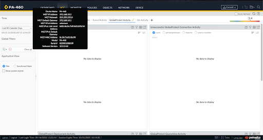
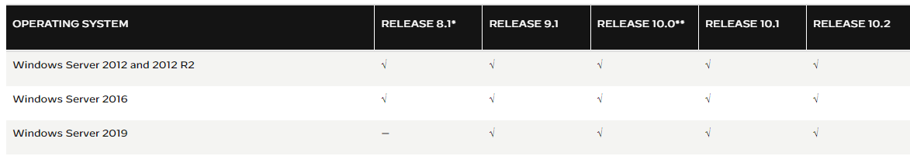
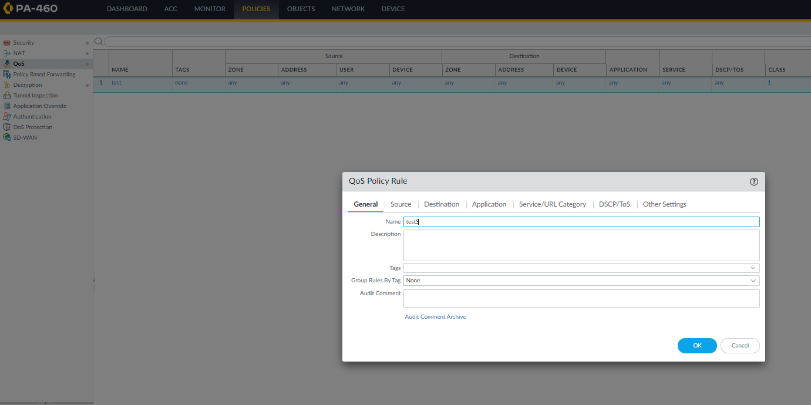
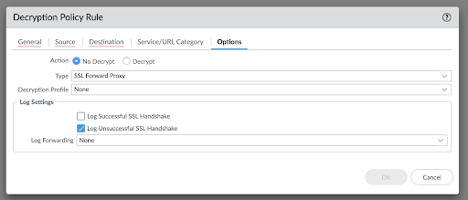
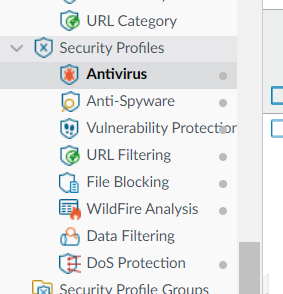
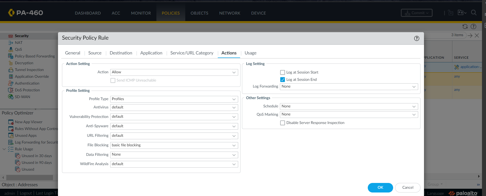
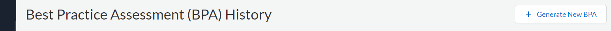

<link href="style.css" rel="stylesheet">

<a class="top-link hide" href="#top">↑</a>

# [User ID](https://docs.paloaltonetworks.com/compatibility-matrix/user-id-agent/where-can-i-install-the-user-id-agent#id8f750af3-799f-4546-8b9e-a44a23b5b5c0)

- can be monitored by **MONITOR** (in **ACTIVITIES** tab)

<g>// can monitor all the activities

- Map users/user group to user ID
- config in User ID Agent & PA GUI -> **DEVICE** -> **USER ID**
- Enable in **Zones**, **User Auth**, **Auth Policy**

[Create a Dedicated Service Account for the User-ID Agent](https://docs.paloaltonetworks.com/pan-os/9-1/pan-os-admin/user-id/map-ip-addresses-to-users/create-a-dedicated-service-account-for-the-user-id-agent#idfc4e397a-3dd1-4a6e-9a13-ee767ecf5bff)

<g>// can also refer to other link->get start

# POLICIES 

## Quality of Service (QoS) (refer to **other link** -> **get start**)
- manages bandwidth for a network segment, limits applications in their consumption while guaranteeing capacity for other applications

## Policy-based Forwarding (refer to **other link** -> **get start**)

- Direct traffic to destination/application/services

## Decryption

- Decrypting traffic correctly identifies it so that the firewall can apply antivirus, vulnerability protection, WildFire, and other protections appropriately

## Tunnel Inspection

- monitor

## Application Override

- override app-id

## Authentication

- authenticate end users before they can access services and applications

## DoS Protection

# Data Loss Prevention

# Security Profile

- setting up different profile
- **POLICES** -> **Security**

# GlobalProtect

- VPN, remote

<html>
<iframe width="560" height="315" src="https://www.youtube.com/embed/F5velYjz_MY" title="YouTube video player" frameborder="0" allow="accelerometer; autoplay; clipboard-write; encrypted-media; gyroscope; picture-in-picture" allowfullscreen></iframe>
</html>

# SD WAN

# Best Practice Assessment

- go to [customer support portal](https://support.paloaltonetworks.com)
- **Tools** -> **Best Practice Assessment**

Example: 
[html](Assets/Feature/Best%20Practice%20Assessment%20-%20Strata%20-%20PA-460-1%202022-09-27%20v6.4.0.html)

[excel](Assets/Feature/Best%20Practice%20Checks%20-%20Strata%20-%20PA-460-1%202022-09-27%20v6.4.0.xlsx)

[pdf](Assets/Feature/BPA%20Executive%20Summary%20-%20Strata%20-%20PA-460-1%202022-09-27%20v6.4.0.pdf)

## Other links

[official guide](https://192.168.10.2/PAN_help/en/wwhelp/wwhimpl/js/html/wwhelp.htm#href=web-interface-basics.html)

[getting start](https://live.paloaltonetworks.com/t5/blogs/getting-started-palo-alto-networks-firewall-series/ba-p/67707)

