# Palo Alto initialise
> ### **Clear default setting**
1. Connect PA with MGT port;
2. Set local host ip under the same subnet with PA (default 192.168.1.1/24);
3. Delete **POLICIES** -> **Security** -> **rule** (if exits);
4. Delete all rules in **POLICIES** -> **NAT**;
5. Delete **NETWORK** -> **Virtual Routers** -> **Default**;
6. Delete **NETWORK** -> **Virtual Wires** -> **default**;
7. Delete **NETWORK** -> **Zones** -> **trust** and **untrust**,
8. Delete **NETWORK** -> **Interfaces** -> **ethernet1/1** and **ethernet1/3**.

> ### **Configuration**
1. In **NETWORK** -> **Interfaces**, **Add** two interfaces, for example, **WAN** and **lan**;

> Both Interface type: Layer 3;\
> set up security zone for each interface (layer 3)\
> WAN_security_zone:\

> lan_security_zone:\

<g>//just click Security zone and clike OK to create</g>

1. In **NETWORK** -> **Virtual Routers**, **Add** a route for WAN infertace.

Gateway as Next Hop:

2. In **POLICIES** -> **NAT**, **Add** a new NAT policy.  Point lan interface to WAN.

3. In **POLICIES** -> **Security**, **Add** a new security rule. Point lan to WAN.  

![security_rule]/Assets/Security_rule_2.png)

4. DHCP configuration
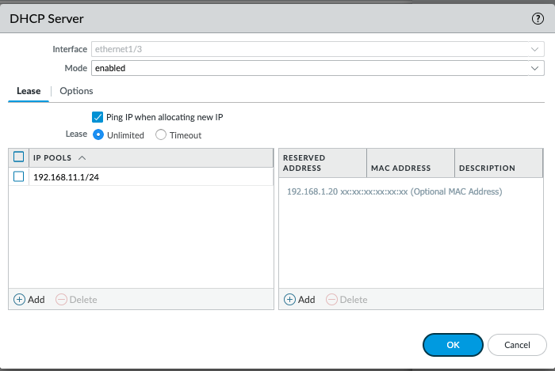

<g>// Check 'Ping IP when allocating new one' may lead to unidentified network.  Why?

  

# Partner License Active #

Go to [**Partner Relationship Management**](https://paloaltonetworkssupport.force.com/NextWavePartnerProgram/s/eval-request/a3N4u000006BV8wEAG/e342127) 
portal 

Click **Evaluations** -> **Evaluation Inventory**, add the hardware you want to active licenses for
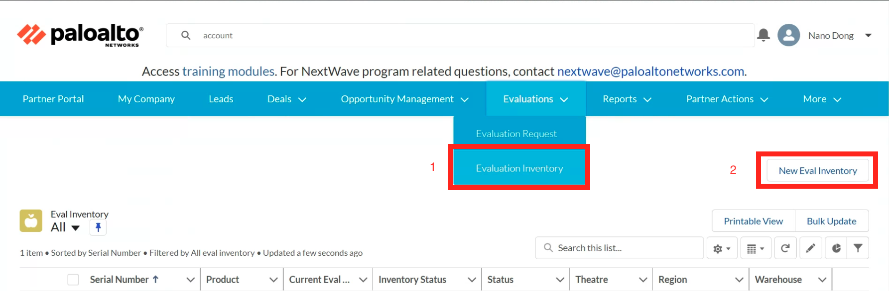 
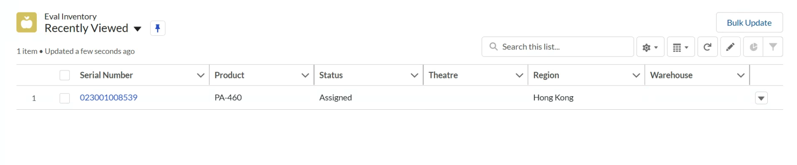 

<g>// you can update the inventory details through **Bulk Update**</g> 

Click **Evaluations** -> **Evaluation Request** to active the devices
 

Select **Eval Type** -> **Customer Eval**, **Opportunity** -> only one that can be selected
<g> // why not other? what is opportunity?  what is CSP account?  </g> 

Click **Add Product**, select the model of the devices/hardware, choose the number you want to active in **Quantity**
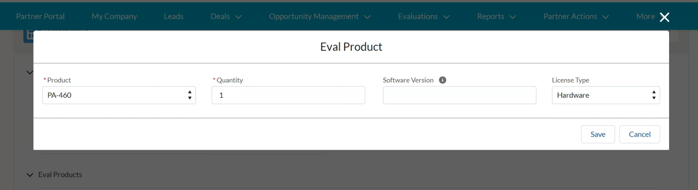
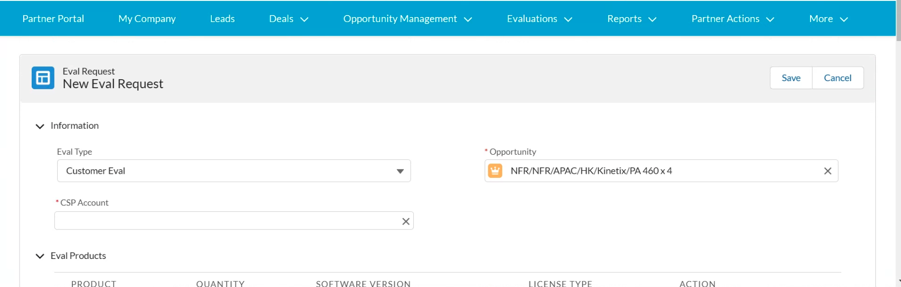
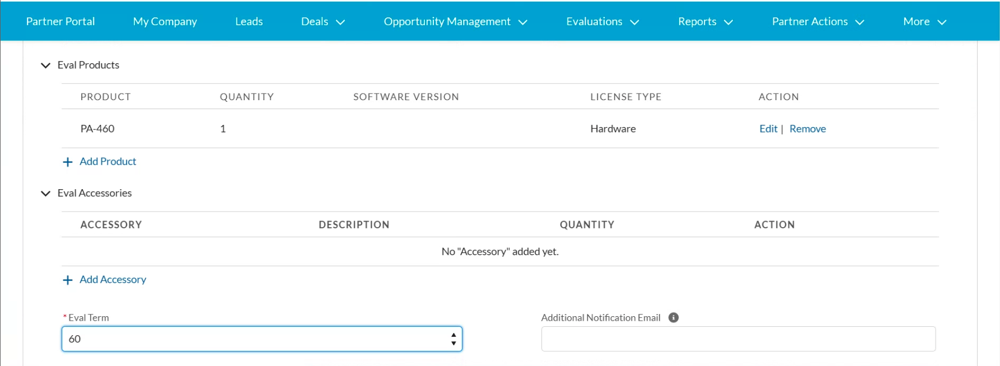
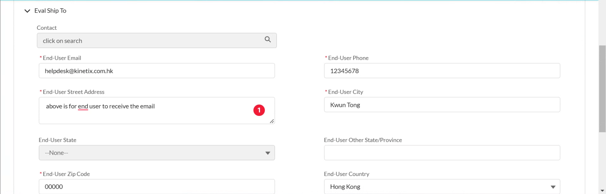

Click **Save**, return to the Request list.
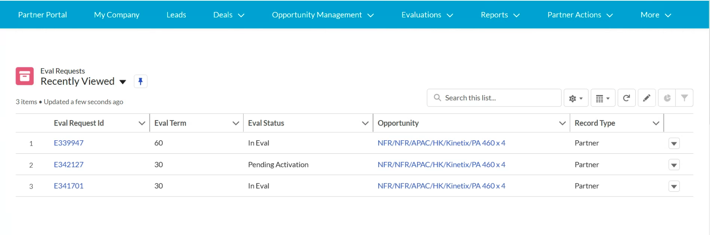

Click the new request you just added, then click **Fulfillment**\
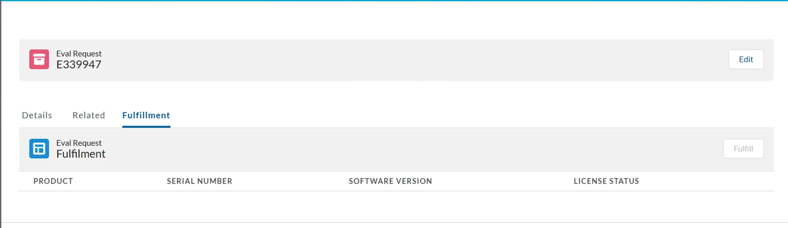

Add the serial number of the device you wanna active.
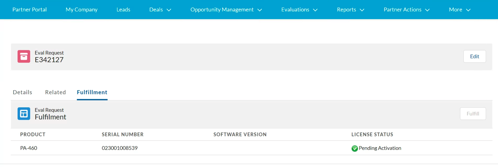

Go back to [**CUSTOMER SUPPORT PORTAL**](https://support.paloaltonetworks.com/), register the device through serial number.

Click **Assets** -> **Devices**
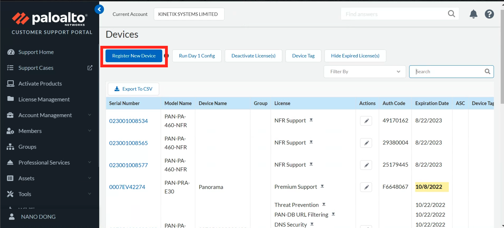

Back to the firewall GUI, retrieve the license.

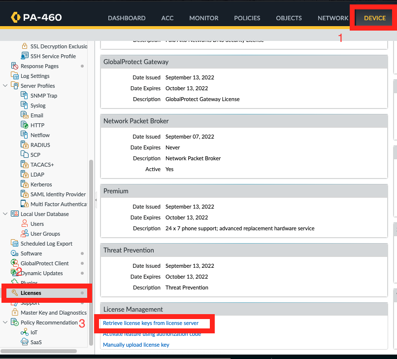

  
# Firewall configure #
  
# Security Lifecycle Review #

