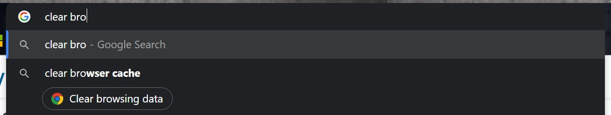
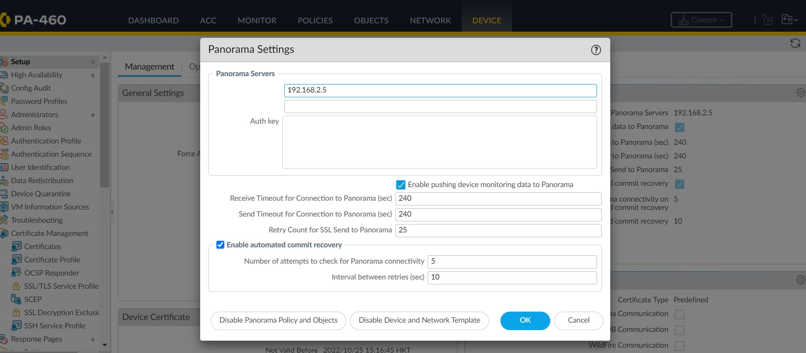
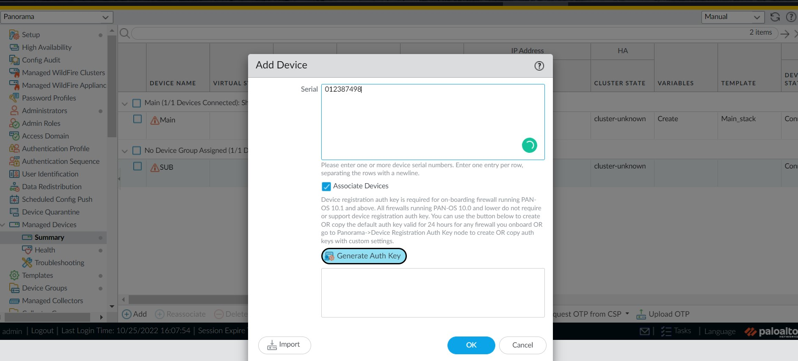
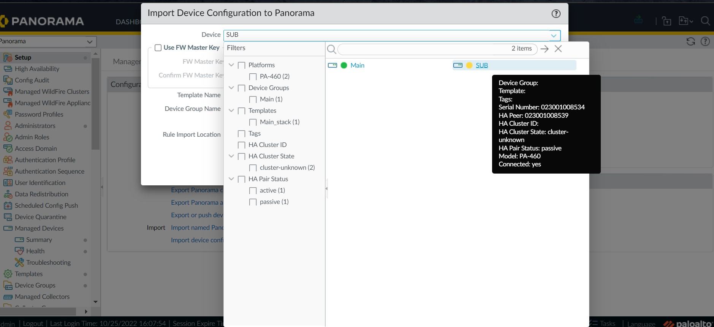
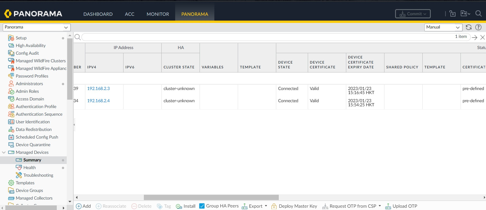

<link href="style.css" rel="stylesheet">

# Troubleshoot Cases

## **table of content**
[Failed to fetch certificates](#failed-to-fetch-certificates)

[Session is timeout](#session-is-timeout)

[Migrate existing UFW Panorama](#)
<br></br>

# <red>**Failed to fetch certificates**

**environment**

OS: 10.2.2-h2

Model: PA-460


# <red>**Session is timeout**

**enviornment**

Error: Failed to login, session time out.

**solution**

1. Clear browser data/cookies/session;


2. or CLI -> debug to check the usage is over 90 or not:

```cli
> show system disk-space
> debug software disk-usage aggressive-cleaning <enable|disable>
```
Check the info:
```bash
> show system state | match aggressive-cleaning
```

For more information: 
[cache debug](https://knowledgebase.paloaltonetworks.com/KCSArticleDetail?id=kA10g000000ClaJCAS)


# <red>**Add existing UFW Panorama**

[**checklist**](https://docs.paloaltonetworks.com/panorama/9-1/panorama-admin/manage-firewalls/transition-a-firewall-to-panorama-management/plan-the-transition-to-panorama-management#id068490d9-66d8-4de4-8c7a-f6bd06b3153e)

簡單啲講：
1. OS of Panorama >= ufw
2. Erase Config sync setting (can HA)
3. can ping each other (check IP connectivity)
4. Check MTU setting
5. Check if permitted ip or not
6. Same ntp (timezone)

Steps: add ufw

> 1.ufw side: **Device** -> **set up** ->  **Management** -> **Panorama Setting**, enter panorama's IP, **commit**
> 
> 
> 2.In panorama: **Panorama** -> **Managed Devices** -> **Summary**, click add and enter serial number.  To-SW-version == OS.
>
> 
> 3.Commit.  Manully refreshed.\
> 4.**Panorama** -> **Set up** -> **Operations**, click *import device configuration to panorama*.  Add the devices config.
>
> 
> 5.Config sync between ufw can enable.  Delete the device groups and templates/stack.
>
> 